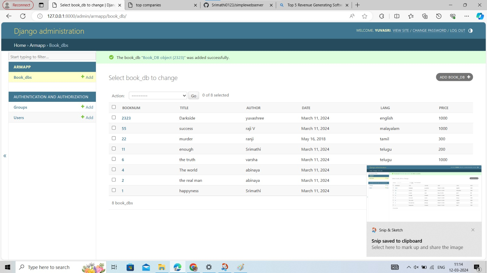

# Ex02 Django ORM Web Application
## Date: 16-05-2024

## AIM
To develop a Django application to store and retrieve data from a Book database using Object Relational Mapping(ORM).

## Entity Relationship Diagram


## DESIGN STEPS

### STEP 1:
Clone the problem from GitHub

### STEP 2:
Create a new app in Django project

### STEP 3:
Enter the code for admin.py and models.py

### STEP 4:
Execute Django admin and create details for 10 books

## PROGRAM

ADMIN.PY
```
from django.contrib import admin
from .models import BOOK,BOOKAdmin
admin.site.register(BOOK,BOOKAdmin)

```
MODELS.PY
```
from django.db import models
from django.contrib import admin
class BOOK(models.Model):
    BOOKNUM=models.CharField(max_length=50,primary_key=True);
    TITLE=models.IntegerField();
    AUTHOR=models.CharField(max_length=50);
    DATE=models.CharField(max length=50);
    PRICE=models.DecimalField(max_digits=10,decimal_places=True);
    
class BOOKAdmin(admin.ModelAdmin):
    list_display=("BOOKNUM","TITLE","AUTHOR","DATE","PRICE");
```

## OUTPUT



## RESULT
Thus the program for creating a database using ORM hass been executed successfully
